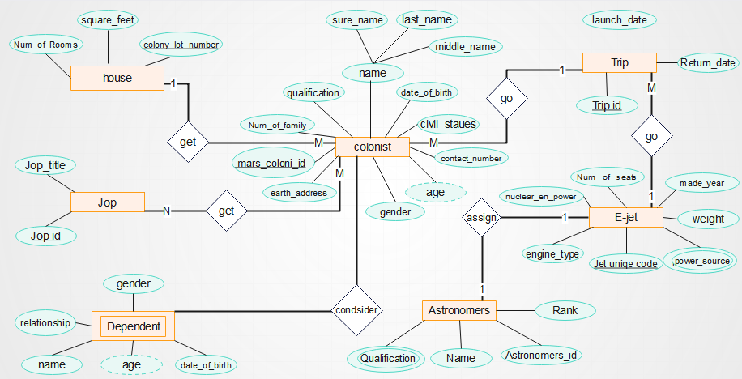
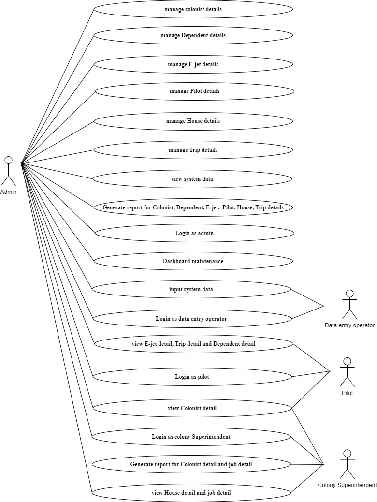
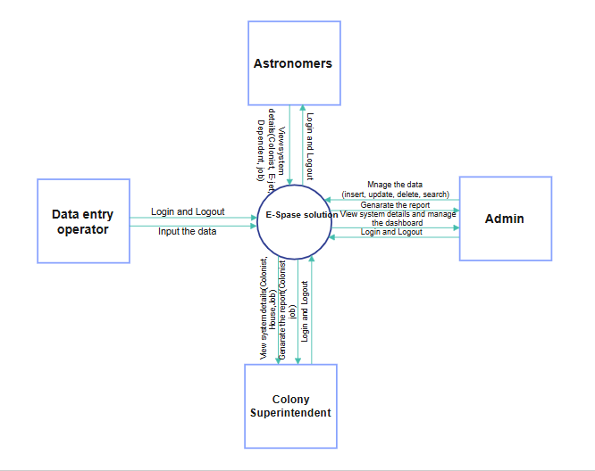

# Mars Colonization Database Management System

A comprehensive database solution designed for **E-Space Solutions (Pvt.) Ltd** to manage colonist registration, pilot and E-Jet scheduling, housing assignments, job allocations, and overall operations for Mars colony missions.

This repository is organized to serve as an academic submission, developer portfolio, and showcases professional database design principles (ER Modeling, Relational Schema Mapping, and Normalization).

---

## 📂 Repository Structure

The project is structured professionally for easy navigation:

```
Mars-Colonization-Database-Management-System/
├── README.md
├── Assignment/
│   ├── Assignment_Report.docx         # Full Academic Assignment Report (Word format)
│   └── Assignment_Report.pdf          # Full Academic Assignment Report (PDF format)
├── Presentation/
│   └── E_Space_Solution_Presentation.pptx # Client Presentation & Solution Pitch Deck
├── Documentation/
│   ├── ERD/
│   │   └── ER_Diagram.png             # High-Resolution Entity-Relationship Diagram
│   ├── Normalization/
│   │   └── Normalization_Process.png  # Normalization flow from 1NF to 3NF
│   ├── DataDictionary/
│   │   └── Data_Dictionary.md         # Tables metadata, constraints, and descriptions
│   ├── UseCase/
│   │   └── Use_Case_Diagram.png       # User roles and system interaction boundaries
│   ├── ActivityDiagram/
│   │   └── Activity_Diagram.png       # Dataflow and operation workflows
│   └── DatabaseDesign/
│       ├── Technical_Document.docx    # System design, error logs, and architectures
│       └── Technical_Document.pdf     # Technical Document (PDF format)
├── Database/
│   ├── SQLScripts/
│   │   └── Schema.sql                 # DDL schema creation script (MS SQL Server)
│   ├── SampleData/
│   │   └── SampleData.sql             # Realistic colonization insert scripts
│   └── Queries/
│       └── Queries.sql                # Showcase DML queries (Filters, Joins, Aggregations)
├── Outputs/
│   ├── Screenshots/                   # WinForms Application GUI screenshots
│   │   ├── Login_Form.png
│   │   ├── Dashboard.png
│   │   ├── Colonist_Details_Form.png
│   │   ├── Astronomers_Form.png
│   │   ├── Trip_Details_Form.png
│   │   ├── Dependents_Form.png
│   │   ├── Jobs_Details_Form.png
│   │   ├── Report_Form.png
│   │   └── (SQL Query execution screenshots)
│   └── Reports/
│       └── User_Manual.pdf            # Step-by-step GUI user guide
└── Assets/                            # Static project assets and design mockups
```

---

## 🚀 Key Modules

*   **Colonist Management**: Tracks colonist credentials, personal profiles, qualifications, and trip assignments.
*   **Dependent Management**: Links spouses and children to primary colonists.
*   **Pilot (Astronomer) Management**: Assigns astronomers to specific ranks, qualifications, and flights.
*   **E-Jet Management**: Stores technical details of transport jets (Type A Nuclear vs Type B Hybrid engines, weights, and seating).
*   **Trip Management**: Coordinates scheduling, launch dates, return dates, and E-Jet assignments.
*   **House Allocation**: Assigns colonists to colony houses and tracks room capacities and square footage.
*   **Job Allocation**: Manages job titles and maps colonists to roles with specific ranks.
*   **Colony Operations**: Overall dashboards and reporting features.

---

## 📊 Database Design

The database consists of **8 interconnected tables** mapped according to third normal form (3NF) to eliminate insertion, deletion, and update anomalies:

1.  **house**: Tracks lot numbers, capacities, and space.
2.  **E_jet**: Core transport shuttle registry.
3.  **job**: Roles catalog.
4.  **Astronomers**: Shuttles pilots and qualifications.
5.  **trip**: Shuttle schedules.
6.  **Colonist**: Settler database containing flight and house mappings.
7.  **dependents**: Relatives mapped to settlers.
8.  **Colonist_job**: Associative entity mapping settlers to jobs.

### 📐 Entity-Relationship Diagram (ERD)



### ⚙️ System Use Case Diagram



### 🌀 System Dataflow / Activity Diagram



---

## 🛠️ Technologies Used

*   **Database Engine**: Microsoft SQL Server / T-SQL
*   **Application Framework**: Windows Forms (.NET Framework 4.7.2)
*   **Language**: C#
*   **Modeling Tools**: ER Modeling, Normalization (1NF, 2NF, 3NF), Use Case and Dataflow Diagrams.

---

## 🔑 Login Credentials (C# Demo)

To run the WinForms application demo ([E_SPACE.exe](E_SPACE/bin/Debug/E_SPACE.exe)):
*   **Username**: `vishnu`
*   **Password**: `0326`

---

## 📝 Setup & Installation

### SQL Database Setup
1. Open **SQL Server Management Studio (SSMS)**.
2. Connect to your local SQL Server instance.
3. Execute the [Schema DDL Script](Database/SQLScripts/Schema.sql) to create the `Own_Espace` database and its tables.
4. Execute the [Sample Data Script](Database/SampleData/SampleData.sql) to populate the tables.
5. Run queries from the [Queries Script](Database/Queries/Queries.sql) to verify setup.

### Desktop Application Setup
1. Open [E_SPACE.sln](E_SPACE.sln) in Visual Studio.
2. If necessary, modify the SQL connection string in [Form1.cs](E_SPACE/Form1.cs) to match your server host:
   ```csharp
   SqlConnection con = new SqlConnection(@"Data Source=YOUR_SERVER_NAME\SQLEXPRESS;Initial Catalog=Own_Espace;Integrated Security=True");
   ```
3. Build and run the project (`F5`).
